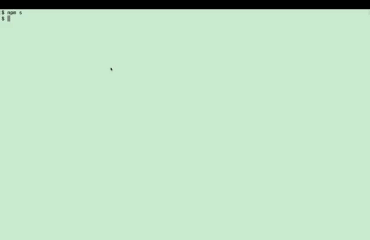

# Command Line Roster

This is a roster running in command line. If you are somehow sick with GUI this is probably an alternative.

## Usage

`npm start`

Customisable via the following [Environment Variables]().

## Prerequisites

- Follow [Node Version Manager](https://github.com/nvm-sh/nvm?tab=readme-ov-file#installing-and-updating) to install `nvm`
- In this project, run `nvm install` to install Node.js
- Then run `npm i` to install dependencies needed by this roster

## Environment Variables

See an example in `.local.env.template`.

- `HYPER_MODE`: (`true`|`false`) Flag to enable hyper mode (as shown in the gif above). If disabled, the roster will only be displayed in the first line of the terminal.
- `TEAM_NAME`: (`string`) Name of your team/group/organisation.
- `OUTPUT_TEMPLATE`: (`string`) Template of the output.
- `NAME_LIST`: (`string`) Comma-separated list of names to be rosted.
- `MANUAL_STOP_MODE` (TODO): (`true`|`false`) Manual stop mode. If set to true, you master your own (and everyone else's being rosted) fate.
